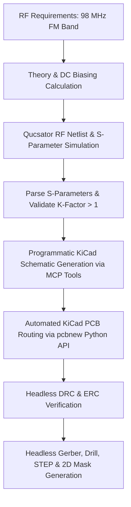

# AGENT.md - Autonomous RF Engineering & Tooling Blueprint

This document is the **technical specification and operational guide** for AI coding assistants, autonomous agents, and RF engineers working with the `lna-ai` repository.

It documents the internal design theory, toolchain automation architecture, command-line interfaces, mathematical derivations, known CAD quirks, and step-by-step instructions for modifying, retuning, or extending this project.

---

## 1. System Architecture & Autonomous Workflow

The entire hardware design was built from first principles and synthesized programmatically with **zero manual GUI layout**:



### Automation Pillars
1. **Simulation Automation**: Qucsator RF netlist execution without launching the Qucs GUI.
2. **Schematic Synthesis**: KiCad 10 S-expression file generation using `kicad-mcp-server` symbol extractors.
3. **PCB Synthesis**: Direct manipulation of KiCad's C++ data model via the Python `pcbnew` module.
4. **Validation & DRC**: Automated KiCad CLI execution for DRC, ERC, Gerber, and drill checks.
5. **Rendering & Masks**: Headless vector and raster generation for top copper, etching photomasks, and solder masks.

---

## 2. RF Engineering Theory & Mathematical Derivations

### 2.1 Topology: Common-Base (CB) vs. Common-Emitter (CE)
For a 98 MHz VHF LNA with a $50\ \Omega$ antenna source, Common-Base (CB) is chosen over Common-Emitter for four fundamental reasons:
1. **Inherent $50\ \Omega$ Match**: The input resistance looking into the emitter is $R_{in} \approx 1/g_m + r_b/(\beta + 1)$. By setting $I_C \approx 7.5\text{ mA}$, $g_m \approx 288\text{ mS} \Rightarrow 1/g_m \approx 3.5\ \Omega$. A simple low-$Q$ $L$-network transforms $50\ \Omega$ down to this value with wide bandwidth.
2. **Zero Miller Effect**: The collector-base capacitance $C_{cb}$ is tied to AC ground at the base. Consequently, there is no Miller multiplication of $C_{cb}$, providing exceptional reverse isolation ($S_{12} = -20.4\text{ dB}$).
3. **High VHF Stability**: With negligible feedback capacitance, Rollett stability factor $K = 1.28 > 1$ and $\Delta < 1$ across the entire 70–130 MHz spectrum without requiring lossy resistive damping in the RF signal path.
4. **High Dynamic Range & Linearity**: The emitter feedback provides strong natural local degeneration, reducing cross-modulation from adjacent high-power FM broadcast transmitters.

### 2.2 DC Biasing Point Selection
For the MMBT5179 ($f_T = 1.4\text{ GHz}$, $V_{CEO} = 12\text{ V}$, $I_{C,\max} = 50\text{ mA}$):
- Supply Voltage: $V_{CC} = 5.0\text{ V}$
- Target Quiescent Collector Current: $I_C = 7.5\text{ mA}$
- Target Collector-Emitter Voltage: $V_{CE} \approx 3.0\text{ V}$
- Thermal Voltage: $V_T \approx 26\text{ mV}$ at $300\text{ K}$
- Transconductance: $g_m = \frac{I_C}{V_T} \approx \frac{7.5\times 10^{-3}}{0.026} \approx 0.288\text{ S} = 288\text{ mS}$
- Emitter Degeneration Resistor $R_3$:
  $$V_E = I_E \cdot R_3 \approx 7.5\text{ mA} \cdot 200\ \Omega = 1.50\text{ V}$$
- Base Voltage $V_B$:
  $$V_B = V_E + V_{BE} = 1.50\text{ V} + 0.75\text{ V} = 2.25\text{ V}$$
- Base Bias Divider ($R_1, R_2$):
  With $V_{CC} = 5.0\text{ V}$, divider current $I_{div} \approx 1.1\text{ mA} \gg I_B$ ($\beta \approx 100 \Rightarrow I_B \approx 75\ \mu\text{A}$):
  $$R_2 = \frac{V_B}{I_{div}} = \frac{2.25\text{ V}}{0.68\text{ mA}} \approx 3.3\text{ k}\Omega$$
  $$R_1 = \frac{V_{CC} - V_B}{I_{div}} = \frac{2.75\text{ V}}{0.68\text{ mA}} \approx 3.9\text{ k}\Omega$$
- Collector DC Voltage: Fed through low-DCR inductor $L_3$, so $V_C \approx V_{CC} = 5.0\text{ V}$.
- Resulting $V_{CE} = V_C - V_E = 5.0\text{ V} - 1.50\text{ V} = 3.50\text{ V}$ (well within safe ratings, maximizing linearity).

### 2.3 Input Matching Network ($L_1, C_1$)
- Source: $Z_0 = 50\ \Omega$
- Load (Emitter): $Z_E \approx 3.5 - j5\ \Omega$ (including emitter lead inductance)
- Transformation: Shunt inductor $L_1 = 27\text{ nH}$ and series capacitor $C_1 = 100\text{ pF}$ transform $50\ \Omega$ to the emitter conjugate impedance at 98 MHz.
- Resulting simulated $S_{11}$: **-34.72 dB** ($Z_{in} = 50.8 - j1.8\ \Omega$, VSWR = 1.04:1).

### 2.4 Collector Resonant Tank & Output Match ($L_3, C_6, C_7, L_4$)
- Center Frequency: $f_0 = 98.0\text{ MHz}$
- Total Resonant Capacitance:
  $$C_{tank} = \frac{1}{(2\pi f_0)^2 \cdot L_3}$$
  With $L_3 = 150\text{ nH}$:
  $$C_{tank} = \frac{1}{(2\pi \cdot 98\times 10^6)^2 \cdot 150\times 10^{-9}} \approx 17.6\text{ pF}$$
  Accounting for transistor $C_{cb} \approx 1.2\text{ pF}$, package and PCB pad stray capacitance $\approx 2.0\text{ pF}$, and series loading through $C_7$ ($10\text{ pF}$ into $50\ \Omega$), the physical tuning capacitor is chosen as **$C_6 = 6.8\text{ pF}$**.
- High-frequency RF choke $L_2 = 470\text{ nH}$ ensures no RF leaks into the emitter bias resistor $R_3$.
- Bias-Tee choke $L_4 = 1.0\ \mu\text{H}$ provides $> 600\ \Omega$ reactance at 98 MHz, isolating the DC feed from the RF signal line.

### 2.5 Coplanar Waveguide with Ground (CPWG) Design
Standard 1.6 mm FR-4 substrate parameters:
- Relative Permittivity: $\varepsilon_r = 4.5$
- Loss Tangent: $\tan \delta = 0.02$
- Substrate Height: $h = 1.6\text{ mm}$
- Copper Foil Thickness: $t = 35\ \mu\text{m}$ (1 oz)
- Characteristic Impedance target: $Z_0 = 50\ \Omega$

Using Wheeler/Schneider conformal mapping for CPWG:
- Trace Width: $W = 1.50\text{ mm}$
- Ground Separation Gap: $S = 0.35\text{ mm}$
- Resulting $Z_0$: **$50.2\ \Omega$**, effective dielectric constant $\varepsilon_{eff} \approx 2.85$.
- Ground Via Stitching Rule: Via fence spacing along CPWG sides is set to **$4.0\text{ mm}$** pitch. At 98 MHz ($\lambda_g \approx 1.77\text{ m}$), $4.0\text{ mm} \ll \lambda/20 \approx 88\text{ mm}$, guaranteeing continuous ground return and suppressing substrate parallel-plate waveguide modes.

---

## 3. Toolchain & Script Reference

### 3.1 `run_qucs_simulation.py` & `parse_qucs.py`
- **Purpose**: Headless execution and evaluation of RF S-parameters.
- **Underlying Engine**: `qucsator_rf.exe` (Qucs-S RF solver).
- **Inputs**: `lna_fm_98mhz_qucs_cpwg.net` (SPICE/Qucs netlist with CPWG transmission lines).
- **Outputs**:
  - `lna_fm_98mhz_qucs_cpwg.dat` (raw binary/text dataset).
  - Formatted ASCII performance table with $S_{21}, S_{11}, S_{22}, S_{12}, K\text{-factor}, Z_{in}$.
  - Touchstone `lna_fm_98mhz_cpwg.s2p` file.
- **CLI Usage**:
  ```bash
  python run_qucs_simulation.py
  ```

### 3.2 `generate_lna.py`
- **Purpose**: Programmatic synthesis of the complete KiCad 10 schematic (`lna_fm_98mhz.kicad_sch`).
- **Dependencies**: Uses `kicad-mcp-server` symbol extractors located at `D:\Programs\kicad-mcp-server\src`.
- **How it works**:
  1. Searches stock KiCad symbol libraries (`Device.kicad_sym`, `Transistor_BJT.kicad_sym`, `Connector.kicad_sym`, etc.).
  2. Converts symbol definitions into embedded `lib_symbols` format.
  3. Computes 2D placement coordinates for all symbols, labels, power flags, and junctions.
  4. Generates unique UUIDs for all nodes and connects pins with S-expression wire segments.
  5. Validates against electrical rules check (ERC) so 0 errors/warnings are produced.
- **CLI Usage**:
  ```bash
  python generate_lna.py
  ```

### 3.3 `build_clean_lna_pcb.py`
- **Purpose**: Programmatic generation of the KiCad 10 PCB layout (`lna_fm_98mhz.kicad_pcb`).
- **Underlying Engine**: KiCad's bundled Python `pcbnew` library (`D:\Programs\KiCad\bin\python.exe`).
- **How it works**:
  1. Creates a new `pcbnew.BOARD()` object and configures design rules (0.35 mm clearance, 0.35 mm trace min).
  2. Creates the `Edge.Cuts` boundary (46.0 mm × 30.0 mm).
  3. Dynamically loads footprints from KiCad's official libraries (`FootprintLoad`), including Samtec edge-mount SMA connectors, SOT-23, and 0805 passives.
  4. Places M3 mounting holes at $(x, y) = (3.5, 3.5), (42.5, 3.5), (3.5, 26.5), (42.5, 26.5)$.
  5. Assigns net connections to every pad (`FindNet`, `SetNet`).
  6. Routes CPWG 50 $\Omega$ transmission lines ($W = 1.5\text{ mm}$, $S = 0.35\text{ mm}$) and DC/bias tracks.
  7. Creates top and bottom copper fill zones (`F.Cu`, `B.Cu`) assigned to `GND` with thermal reliefs and refilling.
  8. Instantiates stitching vias across the ground plane and along the CPWG line perimeter.
  9. Saves the fully routed `.kicad_pcb` file.
- **CLI Usage**:
  ```bash
  & "D:\Programs\KiCad\bin\python.exe" build_clean_lna_pcb.py
  ```

### 3.4 `render_masks.py`
- **Purpose**: Autonomous rendering of 2D engineering artwork, solder masks, and B&W photomasks.
- **Dependencies**: `kicad-cli`, `pypdfium2`, `Pillow`, `numpy`.
- **How it works**:
  1. Calls `kicad-cli pcb export pdf` and `kicad-cli pcb export svg` for targeted layer subsets (`F.Cu`, `F.Mask`, `F.Silkscreen`, `Edge.Cuts`).
  2. Uses `pypdfium2` to rasterize vector pages at high DPI ($\ge 12\times$ scale).
  3. Uses NumPy to identify the bounding box of non-background pixels, compensating for KiCad's origin offset.
  4. Crops precisely to board boundaries and applies uniform symmetric borders on all four sides.
  5. Saves both high-res raster PNGs and vector SVGs/PDFs in `renders/`.
- **CLI Usage**:
  ```bash
  & "D:\Programs\KiCad\bin\python.exe" render_masks.py
  ```

---

## 4. Known Quirks, Gotchas & Lessons Learned

When writing or executing automation scripts for this project, keep the following environment quirks in mind:

### 4.1 KiCad 10 PDF Export Origin vs. Bounding Box
- **Behavior**: When running `kicad-cli pcb export pdf`, KiCad places the board relative to coordinate $(0, 0)$ without auto-centering on the A4 page. If the board's top-left corner is at $(0, 0)$, the top and left edges will touch the page border at coordinate $(0, 0)$.
- **Solution**: Do not attempt simple margin slicing like `(bbox[0] - pad)`. Instead, use the automated pipeline in `render_masks.py`:
  1. Extract the exact bounding box of the board `(x_min, y_min, x_max, y_max)`.
  2. Crop to the board bounds.
  3. Use `PIL.ImageOps.expand(board_crop, border=pad, fill=bg_color)` to add equal margins to all four sides.

### 4.2 Qucs-S CLI Vector vs. Dark Mode SVG
- **Behavior**: Running `qucs-s.exe -p` exports SVGs without an opaque `<rect>` background. When viewed in dark-mode IDEs or browser themes, dark blue lines and black text render against a black background and appear invisible.
- **Solution**: Always use PDF export with `--orin landscape --color RGB --page A4`, or use `render_masks.py` and `generate_qucs_schematic.py` which render via `pypdfium2` on an explicit white canvas.

### 4.3 KiCad 3D Viewer Configuration Protocol
- **Behavior**: When running headless 3D raytrace renders (`kicad-cli pcb render`), KiCad reads visibility settings from:
  `C:\Users\<user>\AppData\Roaming\kicad\10.0\3d_viewer.json`
- **Rule for Agents**: NEVER permanently alter `3d_viewer.json`. If you need to toggle layer visibility (e.g. disabling solder mask or components for bare copper inspection):
  1. Create a backup: `shutil.copyfile(CONFIG_PATH, BACKUP_PATH)`.
  2. Write modified flags inside a `try` block.
  3. In a `finally` block, unconditionally restore the original `3d_viewer.json` from the backup.

### 4.4 SMA Edge-Mount Footprint Geometry
- **Behavior**: Generic SMA footprints are often designed for 1.0 mm boards or through-hole vertical orientation. Using an incorrect footprint causes the PCB edge cutout to overlap or pins to fail physical assembly.
- **Specification**: Use `Connector_Coaxial:SMA_Samtec_SMA-J-P-H-ST-EM1_EdgeMount`. Its ground tang gap is exactly $1.6\text{ mm}$ ($62\text{ mil}$), perfectly matching the FR-4 board edge.

### 4.5 Python Path on Windows
- **Behavior**: Running `python` in Windows PowerShell may invoke the Windows Store Python stub if system Python is not in PATH.
- **Solution**: Always target KiCad's bundled Python interpreter:
  `& "D:\Programs\KiCad\bin\python.exe" <script.py>`

---

## 5. Re-Tuning Protocol for Alternative RF Bands

An agent or developer can retune this LNA design for another center frequency in minutes. Follow this procedure:

### Frequency Tuning Matrix

| Band | Center ($f_0$) | Shunt $L_1$ | Series $C_1$ | Tank $L_3$ | Tank $C_6$ | Output $C_7$ | CPWG $W / S$ |
| :--- | :--- | :--- | :--- | :--- | :--- | :--- | :--- |
| **FM Broadcast** | **98 MHz** | **27 nH** | **100 pF** | **150 nH** | **6.8 pF** | **10 pF** | **1.5 mm / 0.35 mm** |
| **2m Amateur** | 144 MHz | 18 nH | 68 pF | 100 nH | 4.7 pF | 6.8 pF | 1.5 mm / 0.35 mm |
| **Airband (VHF)** | 125 MHz | 22 nH | 82 pF | 120 nH | 5.6 pF | 8.2 pF | 1.5 mm / 0.35 mm |
| **70cm Amateur**| 433 MHz | 5.6 nH | 22 pF | 33 nH | 1.8 pF | 2.2 pF | 1.5 mm / 0.35 mm |

### Execution Steps
1. **Update Netlist**: Edit component values in `lna_fm_98mhz_qucs_cpwg.net`.
2. **Re-run Simulation**: Run `python run_qucs_simulation.py` and verify $S_{21} > 18\text{ dB}$ and $S_{11} < -20\text{ dB}$.
3. **Update PCB Generator**: In `build_clean_lna_pcb.py`, update component values passed to `place_fp()`.
4. **Re-synthesize PCB**: Run `& "D:\Programs\KiCad\bin\python.exe" build_clean_lna_pcb.py`.
5. **Verify DRC**: Run `kicad-cli pcb drc lna_fm_98mhz.kicad_pcb` (ensure 0 violations).
6. **Export Production Files**: Re-run `render_masks.py` and Gerber export commands.

