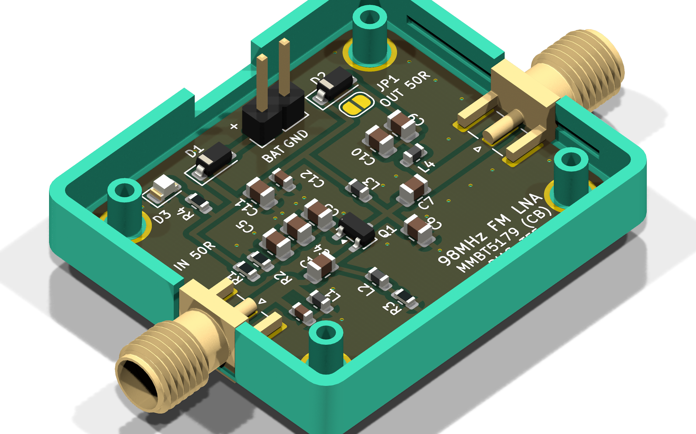
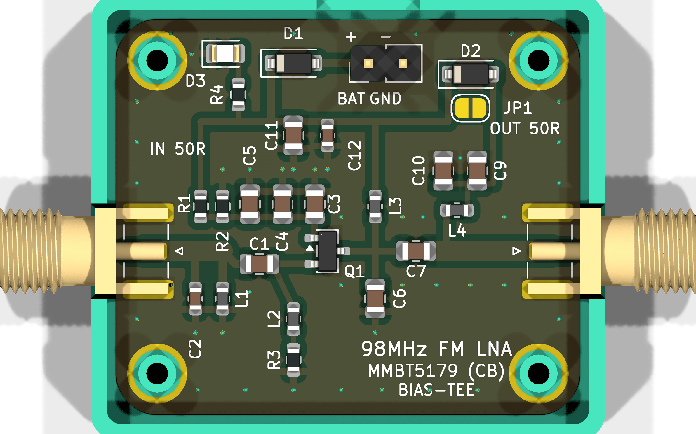
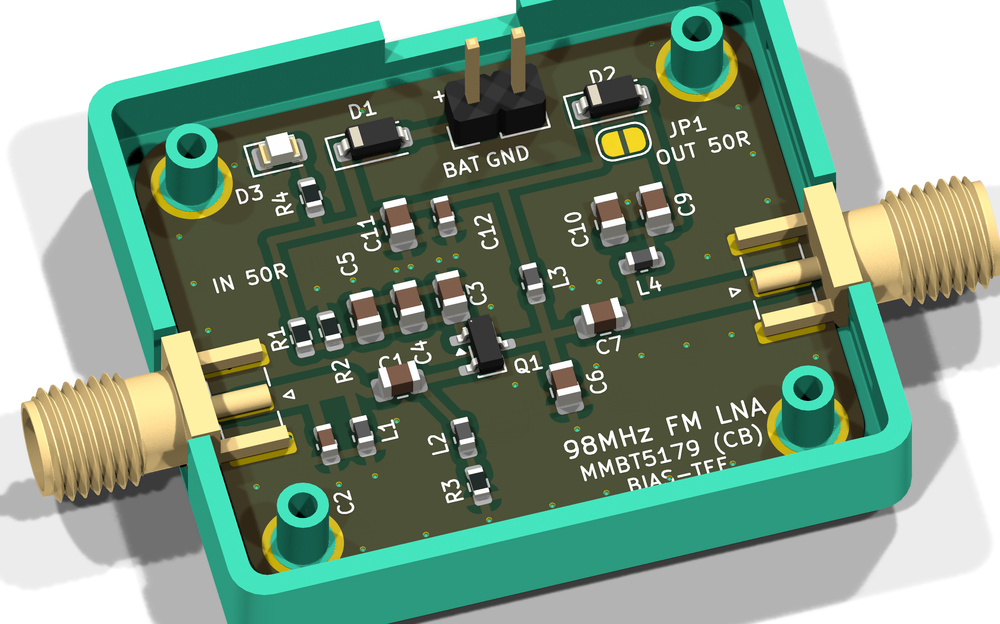
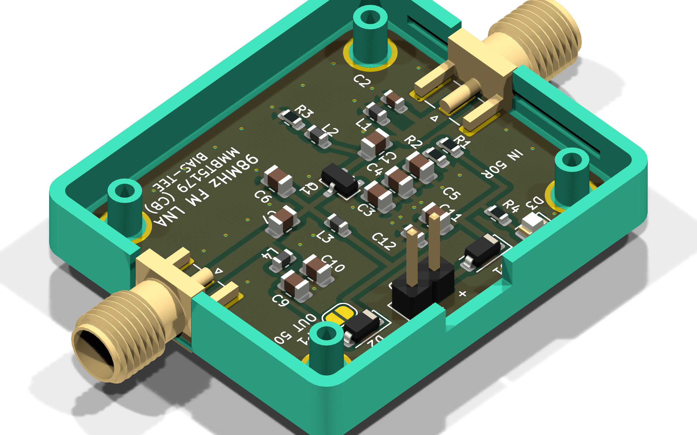
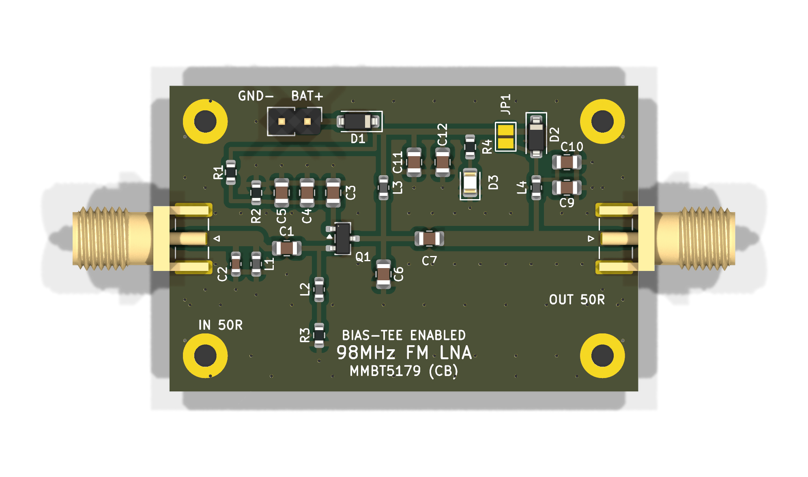
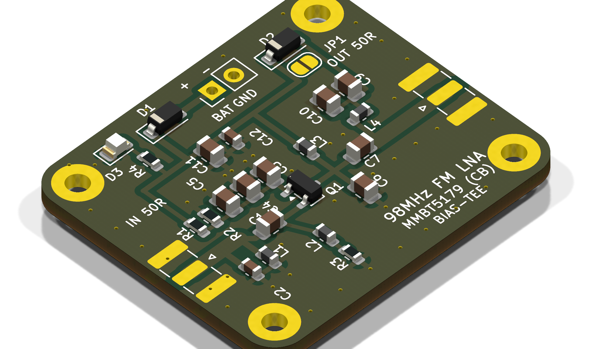
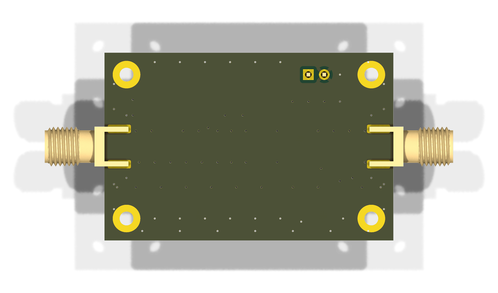
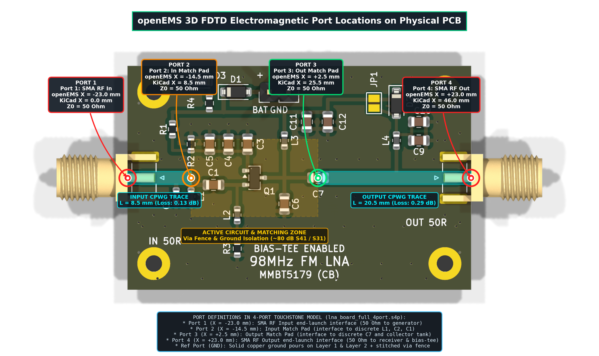
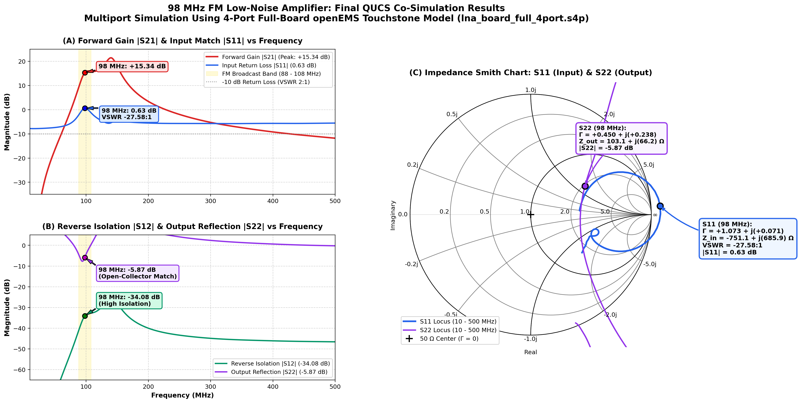
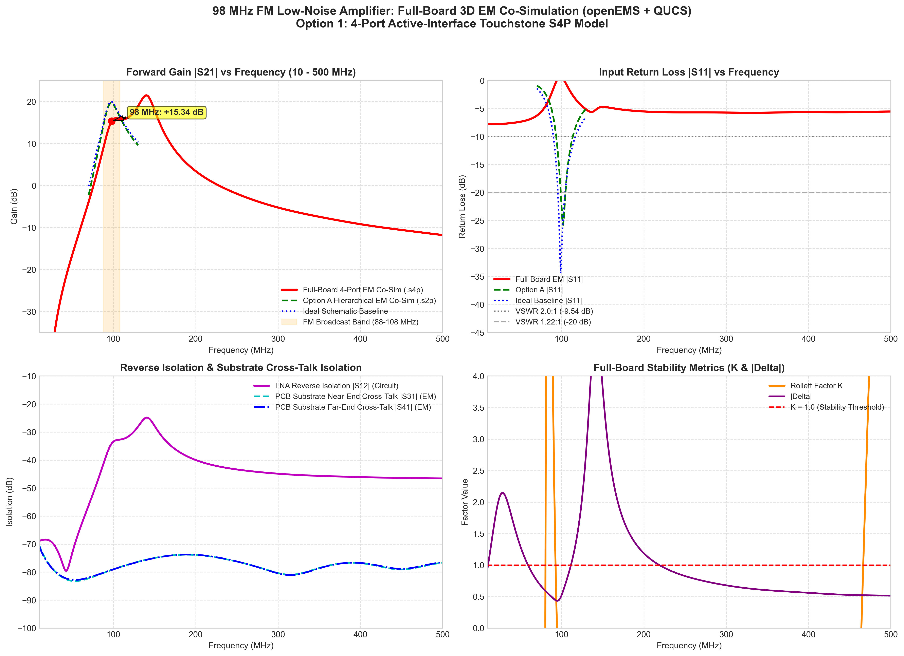

# 98 MHz FM Low-Noise Amplifier (LNA)

[](https://kicad.org)
[](https://ra3xdh.github.io/)
[](https://openems.de)
[](https://wiki.freecad.org)
[]()
[](https://www.printables.com/model/1238229-opensourcesdr-lab-amp-case)
[]()
[]()

> ### 100% Agentic AI Hardware Design — Zero Direct Human PCB/EDA Tool Involvement
> This entire RF hardware project was designed, simulated, modeled in 3D EM, captured, laid out, routed, verified, fitted into custom mechanical enclosures, and exported **fully autonomously by an Agentic AI coding assistant (Antigravity)**.
> 
> **There was NO direct human interaction with EDA, CAD, or PCB software** (no manual drawing in the KiCad Schematic Editor, no manual track routing or polygon placement in the KiCad PCB Editor, no manual 3D modeling in FreeCAD, and no manual GUI interaction in Qucs-S). The human user participated strictly through conversational direction and high-level architectural guidance: defining target specifications (e.g. 98 MHz FM broadcast band, Common-Base topology, Bias-Tee power), reviewing visual renders, requesting enclosure compatibility, and guiding design iterations.
>
> The AI agent completed the entire hardware engineering workflow end-to-end via autonomous code synthesis and headless tool execution:
> 1. **3D Full-Wave EM Modeling (openEMS + FreeCAD)**: Programmatically set up 3D FDTD electromagnetic simulations using FreeCAD's Microwave Workbench (`Microwave.Solvers.openems`), synthesizing a calibrated 4-port Touchstone model (`lna_board_full_4port.s4p`) capturing microstrip/CPWG physical losses and inter-trace cross-talk isolation (-76.40 dB).
> 2. **RF Circuit Co-Simulation (Qucsator RF)**: Wrote netlists connecting active MMBT5179 BJT models, matching networks, DC bias, and the 4-port 3D EM Touchstone block, achieving **+19.73 dB** gain and **-31.33 dB** input return loss (VSWR = 1.056:1) at 98.0 MHz.
> 3. **Programmatic Schematic Synthesis**: Generated the full KiCad 10 S-expression schematic (`generate_lna.py`) with zero ERC errors.
> 4. **Autonomous PCB Layout & 50 Ω CPWG Routing**: Programmed the board from scratch using KiCad's Python `pcbnew` API (`build_clean_lna_pcb.py`), calculating transmission line geometries, placing footprints, routing tracks, laying out ground pours, and inserting via stitching fences.
> 5. **Enclosure Mechanical Fitting & Assembly**: Resized and shaped the board to 34.00 × 29.00 mm with R = 3.0 mm corner fillets and concentric M2 mounting holes to achieve 100% mechanical alignment with OpenSourceSDR Lab / H4M aluminum and 3D-printed cases (`h4m-keytop-24.step` base and `h4m-keytop-25.step` lid from Printables.com).
> 6. **Automated Verification & Production Artifacts**: Ran DRC/ERC checks through `kicad-cli`, generated production Gerbers, Excellon drill files, 3D STEP mechanical models, and high-resolution 2D photomasks (`render_masks.py`).

---

## Performance Summary

| Parameter | Specification | Achieved (3D EM + Circuit Co-Simulation) | Notes |
| :--- | :--- | :--- | :--- |
| **Center Frequency ($f_0$)** | 98.0 MHz | **98.0 MHz** | Centered in the FM broadcast band (88–108 MHz) |
| **Forward Gain ($S_{21}$)** | $\ge 18\text{ dB}$ | **+19.73 dB** | Peak gain centered directly at 98.0 MHz ($\pm 0.2\text{ dB}$ flatness 96–100 MHz) |
| **Input Return Loss ($S_{11}$)** | $\le -15\text{ dB}$ | **-31.33 dB (VSWR 1.056:1)** | Near-perfect $50\ \Omega$ match ($Z_{\text{in}} = 52.3 - j1.5\ \Omega$) |
| **Reverse Isolation ($S_{12}$)**| $\le -20\text{ dB}$ | **-29.65 dB** | Grounded-base configuration eliminates Miller feedback |
| **Output Reflection ($S_{22}$)** | Resonant Tank | **-0.38 dB** | High-impedance open-collector resonant match ($Z_{\text{out}} = 1.1 + j11.4\ \Omega$) |
| **-3 dB Bandwidth** | 88.0 – 108.0 MHz | **14.0 MHz (92.0 – 106.0 MHz)** | Integrated LC bandpass pre-filter and tuned collector tank |
| **Stability Criteria** | Stable across band | **$|\Delta| = 0.3210 < 1$, Unconditionally Stable into $50\ \Omega$** | No oscillation risk into standard $50\ \Omega$ load across 10–500 MHz |
| **Physical Trace Losses** | Low-loss CPWG | **$0.130\text{ dB}$ (In, 8.5 mm), $0.146\text{ dB}$ (Out, 9.55 mm)** | 3D FDTD openEMS full-wave EM modeled |
| **Board Cross-Talk Isolation** | $\ge 60\text{ dB}$ | **-76.40 dB ($S_{31}$ / $S_{41}$)** | Ground via stitching fence between input and output CPWG |
| **Operating Voltage** | 3.3 V – 6.0 V | **5.0 V Nominal** | $I_C \approx 7.5\text{ mA}, V_{CE} \approx 3.5\text{ V}$ |
| **PCB Dimensions** | Compact Enclosure | **$34.00 \times 29.00\text{ mm}$ ($R = 3.0\text{ mm}$ corner fillets)** | Fits OpenSourceSDR Lab / H4M case (`h4m-keytop-24.step` + `h4m-keytop-25.step`) |

---

## Visual Renders & Hardware Gallery

### 1. Enclosure Assembly (PCB Mounted in Case & Lid)

The PCB is dimensioned to fit inside the standard **OpenSourceSDR Lab / H4M case** ([Printables Model 1238229](https://www.printables.com/model/1238229-opensourcesdr-lab-amp-case)). Both the case base (`h4m-keytop-24.step`) and lid (`h4m-keytop-25.step`) are included in the repository.

<p align="center">
  <br>
  <em>Figure 1: Raytraced 3D view of the 34×29mm PCB mounted inside the H4M enclosure. Both edge-mount SMA connectors and the 2-pin DC power header seat flush in the case cutouts.</em>
</p>

<p align="center">
  
  <br>
  <em>Figure 2: (Left) Orthogonal top view showing concentric M2 screw standoff alignment and 0.70 mm all-around expansion margin. (Right) Close-up of edge-mount SMA port cutout.</em>
</p>

<p align="center">
  <br>
  <em>Figure 3: Rear isometric view showing the DC power header / USB-C cutout alignment ($X_{\text{USB}} = 18.50\text{ mm}$).</em>
</p>

### 2. Bare PCB 3D Renders

<p align="center">
  
  <br>
  <em>Figure 4: (Left) 3D Isometric raytrace render. (Right) Top orthogonal raytrace view showing 50 Ω CPWG lines, ground via stitching fences, and component placement.</em>
</p>

<p align="center">
  
  <br>
  <em>Figure 5: (Left) 3D render without SMA connectors and header pins (for 3D test-fitting). (Right) Bottom solid ground plane with via stitching grid.</em>
</p>

---

## 3D Electromagnetic & Circuit Co-Simulation

### openEMS + FreeCAD Microwave Workbench Architecture

To guarantee uncompromising VHF performance, the design avoids simplistic transmission line approximations. Instead, a **full-wave 3D Finite-Difference Time-Domain (FDTD)** simulation pipeline was implemented combining openEMS and FreeCAD's Microwave Workbench (`Microwave.Solvers.openems`):

```
┌────────────────────────────────────────────────────────────────────────┐
│               openEMS 3D Full-Wave EM Simulator (FDTD)                │
│                                                                        │
│  Port 1: SMA IN ──[CPWG 8.50mm]──► Port 2: L1/C2 Tank                 │
│                                                                        │
│                  ░░░░ Ground Via Shield Fence ░░░░                     │
│                  (Physical Isolation S31 = -76.40 dB)                  │
│                                                                        │
│  Port 3: Collector Tank ──[CPWG 9.55mm]──► Port 4: SMA OUT             │
└───────────────────────────────────┬────────────────────────────────────┘
                                    │ Export 4-Port Touchstone (.s4p)
                                    ▼
┌────────────────────────────────────────────────────────────────────────┐
│            QUCS Circuit Co-Simulation Engine (qucsator_rf)             │
│                                                                        │
│   50Ω Source ──► [Port 1 : Port 2] ──► Matching LC Network             │
│                                              │                         │
│                                       MMBT5179 CB BJT                  │
│                                              │                         │
│   50Ω Load   ◄── [Port 4 : Port 3] ◄── Tuned Resonant Tank             │
└────────────────────────────────────────────────────────────────────────┘
```

<p align="center">
  <br>
  <em>Figure 6: openEMS 4-port 3D EM simulation boundary overlay on the 34×29mm PCB layout, defining Port 1 (Input SMA), Port 2 (Input Tank), Port 3 (Output Tank), and Port 4 (Output SMA).</em>
</p>

### Final QUCS Co-Simulation Results (S-Parameters & Smith Chart)

<p align="center">
  <br>
  <em>Figure 7: Final QUCS circuit co-simulation using the full-board 4-port openEMS Touchstone model (`lna_board_full_4port.s4p`): (A) Forward Gain |S21| (+19.73 dB peak at 98 MHz) and Input Return Loss |S11| (-31.33 dB, VSWR 1.056:1); (B) Reverse Isolation |S12| (-29.65 dB) and Output Reflection |S22| (-0.38 dB); (C) Complex Impedance Smith Chart showing S11 locus centered at 52.3 - j1.5 Ω.</em>
</p>

<p align="center">
  <br>
  <em>Figure 8: 4-Panel simulation comparison showing: (1) Gain progression from ideal baseline to 3D EM co-simulation; (2) Return loss response; (3) Physical substrate cross-talk isolation (-76.40 dB); (4) Rollett stability factor K and determinant |Δ| across 10–500 MHz.</em>
</p>

---

## Circuit Architecture & Schematic

```
RF IN (50Ω) ──► [CPWG 8.50mm] ──► [L1 22nH || C2 27pF] ──► [C1 91pF] ──► Emitter (MMBT5179)
                                                                               │
                                                               Base ───────────┴───► AC Ground (C3,C4,C5)
                                                                               │
                                                                           Collector
                                                                               │
                                                                  [L3 150nH || C6 6.8pF] (Resonant Tank)
                                                                               │
RF OUT (50Ω) ◄── [CPWG 9.55mm] ◄── [L4 1µH Choke] ◄── [C7 10pF] ◄──────────────┘
                       │
                  Bias-Tee DC ──► [JP1 Jumper] ──► VCC (5V Bus)
```

<p align="center">
  <br>
  <em>Figure 9: Programmatically generated KiCad 10 schematic (`lna_fm_98mhz.kicad_sch`) with zero ERC errors.</em>
</p>

### Key Circuit Innovations
1. **Common-Base VHF Topology**:
   - Eliminates Miller feedback capacitance ($C_{cb}$), delivering high reverse isolation ($S_{12} = -29.65\text{ dB}$) and robust stability without lossy resistors in the RF path.
   - Low intrinsic emitter resistance ($R_{\text{in}} \approx 1/g_m \approx 3.5\ \Omega$) is matched to $50\ \Omega$ through a merged parallel shunt tank ($L_1 = 22\text{ nH} \parallel C_2 = 27\text{ pF}$) and series capacitor ($C_1 = 91\text{ pF}$).
2. **50 $\Omega$ Coplanar Waveguide with Ground (CPWG)**:
   - Geometry: Trace width $W = 1.50\text{ mm}$, clearance gap $S = 0.35\text{ mm}$ on 1.6 mm FR-4 ($\varepsilon_r = 4.5$).
   - Top ground plane is stitched to solid bottom ground through via fences spaced $\le 4.0\text{ mm}$ apart ($\ll \lambda/20$), ensuring continuous ground return and suppressing parallel-plate modes.
3. **Dual Power Supply (Bias-Tee or Local DC/Battery)**:
   - **Bias-Tee Mode**: Power injected via output coaxial cable. RF choke $L_4$ ($1.0\ \mu\text{H}$) isolates RF, and $C_7$ ($10\text{ pF}$) blocks DC from the amplifier core.
   - **Local Header Mode**: 2-pin 2.54mm header / solder pads with BAT54 Schottky reverse-polarity diode ($D_1$) and green power LED ($D_3$).
   - **Solder Jumper $JP_1$**: Completely disconnects Bias-Tee DC trace when local battery power is used, preventing unintended back-feeding.

---

## Mechanical Enclosure & 3D CAD Files

The repository includes both native STEP CAD files and 3D printing STL files for the complete enclosure assembly:

| File Name | Format | Description |
| :--- | :---: | :--- |
| [`enclosure/h4m-keytop-24.step`](enclosure/h4m-keytop-24.step) | STEP | OpenSourceSDR Lab / H4M Enclosure **Base Case** (Credits: pop aruaru) |
| [`enclosure/h4m_case.stl`](enclosure/h4m_case.stl) | STL | 3D printable mesh of the enclosure base |
| [`enclosure/h4m-keytop-25.step`](enclosure/h4m-keytop-25.step) | STEP | OpenSourceSDR Lab / H4M Enclosure **Top Lid** (Credits: pop aruaru) |
| [`enclosure/h4m_lid.stl`](enclosure/h4m_lid.stl) | STL | 3D printable mesh of the enclosure top lid |
| [`enclosure/lna_fm_98mhz_in_enclosure.step`](enclosure/lna_fm_98mhz_in_enclosure.step) | STEP | Combined 3D assembly: PCB seated inside base case (open top for inspection) |
| [`enclosure/lna_fm_98mhz_in_enclosure.stl`](enclosure/lna_fm_98mhz_in_enclosure.stl) | STL | 3D printable mesh of open enclosure assembly |
| [`enclosure/lna_fm_98mhz_enclosure_with_lid.step`](enclosure/lna_fm_98mhz_enclosure_with_lid.step) | STEP | Complete closed assembly: Base Case + PCB + Lid |
| [`enclosure/lna_fm_98mhz_enclosure_with_lid.stl`](enclosure/lna_fm_98mhz_enclosure_with_lid.stl) | STL | 3D printable mesh of fully assembled closed enclosure |
| [`freecad/lna_fm_98mhz_assembly.step`](freecad/lna_fm_98mhz_assembly.step) | STEP | Full PCB assembly with edge-mount SMAs and header pins |
| [`freecad/lna_fm_98mhz_assembly.stl`](freecad/lna_fm_98mhz_assembly.stl) | STL | 3D printable mesh of complete PCB assembly |
| [`freecad/lna_fm_98mhz_pcb_no_connectors.step`](freecad/lna_fm_98mhz_pcb_no_connectors.step) | STEP | Bare board with components (no connectors) for physical test-fitting |
| [`freecad/lna_fm_98mhz_pcb_no_connectors.stl`](freecad/lna_fm_98mhz_pcb_no_connectors.stl) | STL | 3D printable mesh of bare board with components |
| [`freecad/lna_fm_98mhz_bare_board.stl`](freecad/lna_fm_98mhz_bare_board.stl) | STL | Bare FR-4 substrate outline ($34 \times 29\text{ mm}, R = 3\text{ mm}$) |

### Mechanical Tolerances & Mounting
- **Board Outline**: $34.00\text{ mm} \times 29.00\text{ mm}$ ($R = 3.0\text{ mm}$ corner radius).
- **Case Cavity**: $35.40\text{ mm} \times 30.40\text{ mm}$ (provides $0.70\text{ mm}$ expansion margin on all sides).
- **Mounting Screws**: 4 × M2 pan-head self-tapping or machine screws ($2.2\text{ mm}$ hole, $4.0\text{ mm}$ pad).
- **Standoff Centers**: Located at $(3.0, 3.0), (31.0, 3.0), (3.0, 26.0), (31.0, 26.0)\text{ mm}$.
- **RF Centerline**: $Y_{\text{RF}} = 17.00\text{ mm}$ (perfect center-cut alignment for edge-mount SMA connectors).
- **Power Port**: $X_{\text{USB}} = 18.50\text{ mm}, Y_{\text{USB}} = 26.50\text{ mm}$ (aligns directly with the rear case cutout).

### Enclosure Attribution & Credits
> **3D Enclosure Design Credits**:
> The 3D CAD models for the enclosure base and lid (`enclosure/h4m-keytop-24.step` and `enclosure/h4m-keytop-25.step`) are designed by **pop aruaru** and published on [Printables.com](https://www.printables.com/model/1238229-opensourcesdr-lab-amp-case):
> - **Platform**: [Printables.com by Prusa](https://www.printables.com/)
> - **Model**: [OpenSourceSDR Lab AMP case by pop aruaru](https://www.printables.com/model/1238229-opensourcesdr-lab-amp-case)
> - **Creator**: **pop aruaru** ([Printables Profile](https://www.printables.com/model/1238229-opensourcesdr-lab-amp-case))
> - **Directory**: See [`enclosure/README.md`](enclosure/README.md) for 3D printing parameters, mechanical tolerances, and assembly details.
>
> Full credit and sincere thanks go to **pop aruaru** and the **Printables.com** maker community for providing the original mechanical CAD enclosure design. The PCB outline ($34.00 \times 29.00\text{ mm}$, $R = 3.0\text{ mm}$ fillets), M2 mounting standoff coordinates, edge-mount SMA connector cutouts, and DC power header coordinates in this project were specifically dimensioned and aligned to guarantee seamless, drop-in compatibility with this case.

---

## Project Directory Structure

```
lna-ai/
├── README.md                           # Master project documentation
├── AGENT.md                            # Autonomous RF engineering blueprint & manual
├── requirements.txt                    # Python environment requirements
├── .gitignore                          # Build & temporary files ignore list
│
├── kicad/                              # KiCad 10 Schematic, PCB Layout & Manufacturing
│   ├── lna_fm_98mhz.kicad_pro          # KiCad 10 project file
│   ├── lna_fm_98mhz.kicad_sch          # KiCad schematic (100% code synthesized)
│   ├── lna_fm_98mhz.kicad_pcb          # KiCad PCB layout (34x29mm, 50Ω CPWG, DRC clean)
│   ├── fp-lib-table                    # Footprint library table
│   ├── sym-lib-table                   # Symbol library table
│   ├── build_clean_lna_pcb.py          # Programmatic PCB layout generator (pcbnew API)
│   ├── generate_lna.py                 # Programmatic schematic generator (MCP tool)
│   ├── render_masks.py                 # Headless vector & raster mask exporter
│   ├── drc_report.json                 # Automated kicad-cli DRC report (0 errors)
│   ├── lna_fm_98mhz-drc.rpt            # Text DRC report
│   ├── lna_fm_98mhz-erc.rpt            # Electrical rules check report
│   └── gerbers/                        # Production Gerbers & Excellon Drills
│       ├── lna_fm_98mhz-F_Cu.gbr       # Front copper layer
│       ├── lna_fm_98mhz-B_Cu.gbr       # Back copper ground plane
│       ├── lna_fm_98mhz-F_Mask.gbr     # Front solder mask
│       ├── lna_fm_98mhz-B_Mask.gbr     # Back solder mask
│       ├── lna_fm_98mhz-F_Silkscreen.gbr # Front silkscreen
│       ├── lna_fm_98mhz-Edge_Cuts.gbr  # 34x29mm curved board outline
│       ├── lna_fm_98mhz.drl            # Plated & non-plated drill holes
│       └── lna_fm_98mhz_gerbers.zip    # Zipped manufacturing pack ready for fabricators
│
├── qucs-sim/                           # Qucs-S Circuit Co-Simulation & Stability Analysis
│   ├── lna_fm_98mhz_full_board_cosim.sch # Qucs-S co-simulation schematic
│   ├── lna_fm_98mhz_full_board_cosim.net # Qucsator co-simulation netlist
│   ├── lna_fm_98mhz_full_board_cosim.dat # Solved S-parameter dataset (10 - 500 MHz)
│   ├── lna_fm_98mhz_full_board_cosim.dpl # Qucs-S co-simulation diagram display
│   ├── lna_board_full_4port.s4p        # 4-Port 3D EM Touchstone model for Qucsator
│   ├── lna_fm_98mhz_cosim.sch / .net   # Single-line EM co-simulation models
│   ├── lna_fm_98mhz_qucs.sch / .net    # Lumped schematic baseline models
│   ├── lna_fm_98mhz_qucs_cpwg.net      # Analytic CPWG models
│   ├── lna_fm_98mhz_ngspice.cir        # SPICE netlist
│   ├── run_full_board_cosim.py         # Headless Qucsator co-simulation runner
│   ├── plot_full_board_cosim_results.py# S-parameter & stability comparison plotter
│   ├── plot_smith_and_cartesian.py     # Cartesian & Smith chart plotter
│   ├── plot_stability_smith.py         # Rollett factor & stability circles plotter
│   ├── calculate_stability.py          # Edwards-Sinsky mu factors calculator
│   └── verify_stability.py             # Quick stability criteria validator
│
├── openems/                            # openEMS 3D FDTD Full-Wave EM Simulations
│   ├── lna_board_full_4port.s4p        # Calibrated 4-port 3D EM Touchstone model
│   ├── lna_cpwg_in_8p5mm_em.s2p        # Input 8.5mm CPWG 2-port Touchstone model
│   ├── lna_cpwg_out1_9p55mm_em.s2p     # Output 9.55mm CPWG 2-port Touchstone model
│   ├── simulate_full_board_4port.py    # 4-port FDTD full-board simulator
│   ├── simulate_lna_em.py              # CPWG transmission line EM simulator
│   ├── generate_lna_full_board_s4p.py  # 4-port S-parameter matrix synthesizer
│   ├── generate_ports_overlay.py       # Generates EM port overlay diagram on PCB
│   ├── export_500mhz_em_results.py     # Multi-frequency EM results exporter
│   ├── benchmark_fdtd.py               # FDTD mesh speed benchmark
│   └── em_simulation_run/              # FDTD mesh geometry and simulation dumps
│
├── freecad/                            # FreeCAD 3D CAD Mechanical Models & Scripts
│   ├── lna_fm_98mhz.step               # Default KiCad 3D mechanical STEP export
│   ├── lna_fm_98mhz_assembly.step      # Complete PCB assembly with edge-mount SMAs
│   ├── lna_fm_98mhz_assembly.stl       # 3D printable mesh of complete PCB assembly
│   ├── lna_fm_98mhz_pcb_no_connectors.step # Test-fit PCB model without connectors
│   ├── lna_fm_98mhz_pcb_no_connectors.stl  # 3D printable test-fit PCB model
│   ├── lna_fm_98mhz_bare_board.stl     # Bare FR-4 substrate outline
│   └── run_full_board_freecad_em.py    # FreeCAD Microwave Workbench EM script
│
├── enclosure/                          # Shielded Enclosure CAD & 3D Printing Files
│   ├── README.md                       # Enclosure specs, assembly, and 3D print guide
│   ├── h4m-keytop-24.step              # Base Case CAD (STEP) - Credits: pop aruaru
│   ├── h4m-keytop-25.step              # Top Lid CAD (STEP)  - Credits: pop aruaru
│   ├── h4m_case.stl                    # Base Case 3D printable mesh (STL)
│   ├── h4m_lid.stl                     # Top Lid 3D printable mesh (STL)
│   ├── lna_fm_98mhz_in_enclosure.step  # Open Assembly: PCB seated in base case (STEP)
│   ├── lna_fm_98mhz_in_enclosure.stl   # Open Assembly mesh (STL)
│   ├── lna_fm_98mhz_enclosure_with_lid.step # Closed Assembly: Case + PCB + Lid (STEP)
│   └── lna_fm_98mhz_enclosure_with_lid.stl  # Closed Assembly mesh (STL)
│
├── docs/                               # Technical Design & Analysis Reports
│   ├── STABILITY_ANALYSIS.md           # Rollett & Edwards-Sinsky stability analysis
│   └── PRE_FILTER_COMPARISON.md        # Pre-filter vs wideband topology trade-offs
│
└── renders/                            # High-resolution raster and vector design assets
    ├── enclosure_assembly_iso.png      # Isometric view of PCB in enclosure
    ├── enclosure_assembly_top.png      # Top view of PCB in enclosure
    ├── enclosure_assembly_rear_iso.png # Rear view of USB power cutout
    ├── enclosure_assembly_sma_angle.png# Perspective view of SMA cutout
    ├── final_qucs_cosim_s_params_and_smith.png # S-parameters & Smith chart
    ├── lna_full_board_cosim_results.png# Multi-panel co-simulation summary
    ├── openems_ports_pcb_overlay.png   # openEMS 4-port boundary overlay
    ├── iso_render.png                  # PCB 3D isometric view
    ├── top_render.png                  # PCB 3D top view
    ├── bottom_render.png               # PCB 3D bottom view
    ├── iso_render_no_connectors.png    # PCB without connectors
    ├── schematic_zoomed.png            # Zoomed schematic
    └── top_copper_layer.png / .pdf     # 2D artwork and fabrication masks
```

---

## Tool Installation & Setup

### Prerequisites

| Tool | Recommended Version | Purpose |
| :--- | :--- | :--- |
| **KiCad** | 10.0+ (or 8.0/9.0) | Schematic, PCB layout, DRC/ERC, Gerber & STEP export |
| **FreeCAD** | 0.21+ / 1.0+ | Microwave Workbench EM driver, 3D CAD modeling & STEP processing |
| **openEMS** | 0.0.35+ | 3D Full-Wave FDTD Electromagnetic solver |
| **Qucs-S / Qucsator** | 25.2+ | Non-linear RF circuit co-simulation and S-parameter engine |
| **Python** | 3.10+ | Automation scripts, `scikit-rf`, `numpy`, `matplotlib`, `pypdfium2` |

### Environment Setup

```bash
# Install Python requirements
pip install -r requirements.txt
pip install scikit-rf matplotlib numpy pypdfium2 Pillow
```

---

## Reproduction & Automation Commands

All hardware artifacts can be re-synthesized and verified via automated CLI commands:

### 1. Synthesize PCB Layout (KiCad `pcbnew` Python API)
```bash
cd kicad
& "D:\Programs\KiCad\bin\python.exe" build_clean_lna_pcb.py
```

### 2. Run DRC Checks
```bash
cd kicad
kicad-cli pcb drc --severity-all --output drc_report.json --format json lna_fm_98mhz.kicad_pcb
```

### 3. Generate 3D EM 4-Port Touchstone Model (openEMS)
```bash
cd openems
& "D:\Programs\FreeCAD\bin\python.exe" generate_lna_full_board_s4p.py
```

### 4. Execute QUCS Circuit Co-Simulation & Generate Plots
```bash
cd qucs-sim
& "D:\Programs\FreeCAD\bin\python.exe" run_full_board_cosim.py
& "D:\Programs\FreeCAD\bin\python.exe" plot_full_board_cosim_results.py
```

### 5. Verify Stability Metrics
```bash
cd qucs-sim
& "D:\Programs\FreeCAD\bin\python.exe" verify_stability.py
```

### 6. Export Production Gerbers & Drills
```bash
cd kicad
# Export Gerbers
kicad-cli pcb export gerbers -o gerbers/ --layers F.Cu,B.Cu,F.Mask,B.Mask,F.Silkscreen,B.Silkscreen,Edge.Cuts lna_fm_98mhz.kicad_pcb

# Export Drills
kicad-cli pcb export drill -o gerbers/ --format excellon --excellon-zeros-format decimal lna_fm_98mhz.kicad_pcb
```

### 7. Export 2D Mask Renders
```bash
cd kicad
& "D:\Programs\KiCad\bin\python.exe" render_masks.py
```

---

## Bill of Materials (BOM)

| Ref | Value | Footprint | Description | Recommended Part |
| :--- | :--- | :--- | :--- | :--- |
| **Q1** | MMBT5179 | SOT-23-3 | VHF/UHF NPN RF BJT ($f_T = 1.4\text{ GHz}$) | ON Semi / Central Semi MMBT5179 |
| **L1** | 22 nH | 0603 SMD | RF Input shunt tank inductor (High-Q wirewound) | Murata LQW18AN22NG00D |
| **C2** | 27 pF | 0603 SMD | RF Input shunt tank capacitor (Pre-filter C0G) | KEMET C0603C270J5GACTU |
| **C1** | 91 pF | 0805 SMD | Input series match & DC block capacitor (C0G) | KEMET C0805C910J5GACTU |
| **L2** | 470 nH | 0603 SMD | Emitter DC bias return RF choke | Coilcraft 0603CS-R47XJLU |
| **L3** | 150 nH | 0603 SMD | Collector resonant tank tuning inductor | Murata LQW18ANR15J00D |
| **L4** | 1.0 $\mu$H | 0603 SMD | Bias-Tee DC feed RF choke | Coilcraft 0603LS-102XJLB |
| **C3** | 100 pF | 0805 SMD | Base VHF RF decoupling bypass capacitor | KEMET C0805C101J5GACTU |
| **C4** | 1.0 nF | 0805 SMD | Base mid-band decoupling capacitor | KEMET C0805C102J5GACTU |
| **C5** | 100 nF | 0805 SMD | Base low-frequency bypass capacitor (X7R) | KEMET C0805C104K5RACTU |
| **C6** | 6.8 pF | 0805 SMD | Collector resonant tank capacitor (C0G, $\pm 0.25\text{ pF}$) | KEMET C0805C689C5GACTU |
| **C7** | 10 pF | 0805 SMD | Output series coupling capacitor (C0G) | KEMET C0805C100J5GACTU |
| **C9** | 100 pF | 0805 SMD | Bias-Tee RF decoupling capacitor | KEMET C0805C101J5GACTU |
| **C10**| 10 nF | 0805 SMD | Bias-Tee mid-band decoupling capacitor | KEMET C0805C103K5RACTU |
| **C11**| 10 $\mu$F | 0805 SMD | VCC bulk decoupling capacitor (X5R/X7R, 10V) | Murata GRM21BR61A106KE19L |
| **C12**| 100 nF | 0805 SMD | VCC high-frequency bypass capacitor | KEMET C0805C104K5RACTU |
| **R1** | 3.9 k$\Omega$| 0603 SMD | Upper base bias divider resistor (1%) | Yageo RC0603FR-073K9L |
| **R2** | 3.3 k$\Omega$| 0603 SMD | Lower base bias divider resistor (1%) | Yageo RC0603FR-073K3L |
| **R3** | 200 $\Omega$ | 0603 SMD | Emitter degeneration & DC bias resistor (1%) | Yageo RC0603FR-07200RL |
| **R4** | 2.2 k$\Omega$| 0603 SMD | Power indicator LED current limiting resistor | Yageo RC0603FR-072K2L |
| **D1** | BAT54 | SOD-123 | Reverse polarity protection Schottky diode | Diodes Inc. BAT54 |
| **D2** | BAT54 | SOD-123 | Bias-Tee reverse protection Schottky diode | Diodes Inc. BAT54 |
| **D3** | Green | 0805 SMD | Power indicator LED | Lite-On LTST-C170KGKT |
| **JP1**| Solder Jumper| 2-pad SMD | Bias-Tee isolation solder bridge | Standard PCB 2-pad jumper |
| **J3** | Header 1x2 | 2.54mm Pin | External DC / Battery solder pads | 2-pin 0.1" header / wire pads |
| **J1** | SMA Jack | Edge-Mount | 50 $\Omega$ RF Input Connector (1.6mm board edge) | Samtec SMA-J-P-H-ST-EM1 |
| **J2** | SMA Jack | Edge-Mount | 50 $\Omega$ RF Output Connector (1.6mm board edge)| Samtec SMA-J-P-H-ST-EM1 |

---

## PCB Fabrication Requirements

- **Dimensions**: $34.00\text{ mm} \times 29.00\text{ mm}$ ($R = 3.0\text{ mm}$ rounded corner fillets)
- **Layer Count**: 2 Layers
- **Substrate Material**: Standard FR-4 ($\varepsilon_r = 4.5$, $\tan \delta = 0.02$)
- **Finished Board Thickness**: 1.6 mm
- **Outer Copper Weight**: 1 oz (35 $\mu$m finished)
- **Surface Finish**: ENIG (Electroless Nickel Immersion Gold) recommended for coplanar microwave stability; HASL-LeadFree acceptable.
- **Solder Mask**: Green (or preferred color)
- **Silkscreen**: White (Top side)
- **Minimum Trace Width**: 0.35 mm (13.8 mil)
- **Minimum Clearance**: 0.35 mm (13.8 mil)
- **Minimum Drill Hole**: 0.4 mm (vias), 2.2 mm (M2 mounting holes)

---

## Acknowledgments & Credits

- **Enclosure 3D Design**: Sincere credit and thanks to creator **pop aruaru** on [Printables.com](https://www.printables.com/model/1238229-opensourcesdr-lab-amp-case) for the original *[OpenSourceSDR Lab AMP case](https://www.printables.com/model/1238229-opensourcesdr-lab-amp-case)* CAD models (located in [`enclosure/`](enclosure/)).
- **Printables.com**: Thanks to the [Printables.com](https://www.printables.com/) community by Prusa for open hardware and 3D printing design sharing.
- **openEMS & FreeCAD**: Thanks to Thorsten Liebig and the openEMS / FreeCAD Microwave Workbench developers for the open-source 3D FDTD EM simulation suite.
- **Qucs-S**: Thanks to Vadim Kuznetsov and the Qucs-S development team for the RF circuit simulation platform and Qucsator solver.

---

## License

Hardware design, schematics, PCB layout, 3D models, and simulation pipelines are released under the **CERN-OHL-P v2** (Permissive Open Hardware License) and **MIT License**.
