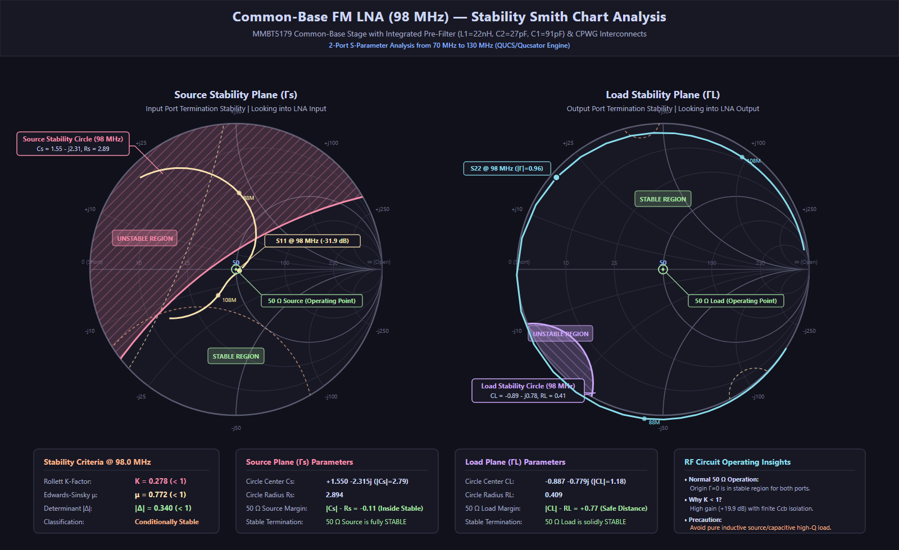

# 98 MHz Common-Base LNA — RF Stability & Smith Chart Analysis

---

## 1. Executive Summary

This report evaluates the **two-port stability** of the 98 MHz Common-Base Low Noise Amplifier (MMBT5179 with integrated pre-filter LC tank $L_1 = 22\text{ nH}, C_2 = 27\text{ pF}, C_1 = 91\text{ pF}$ and coplanar waveguide interconnects) across the 70–130 MHz frequency range.

- **Rollett Factor $K$:** $0.278 < 1$ (**Conditionally Stable**)
- **Edwards-Sinsky Geometric Factor $\mu$:** $0.772 < 1$
- **Determinant $|\Delta|$:** $0.340 < 1$
- **Nominal $50\ \Omega$ Terminations:** **Completely Stable** ($|\Gamma_{in}| = 0.0255$, $|\Gamma_{out}| = 0.9642$). The $50\ \Omega$ source and load operating points lie safely inside the stable regions on both Smith charts.

---

## 2. 2-Port S-Parameters at $f_0 = 98.0\text{ MHz}$

| Parameter | Complex Value | Magnitude | Decibels (dB) | Phase |
| :--- | :--- | :--- | :--- | :--- |
| **$S_{11}$ (Input Match)** | $+0.0242 - j0.0082$ | $0.0255$ | **$-31.87\text{ dB}$** | $-18.7^\circ$ |
| **$S_{21}$ (Forward Gain)** | $-8.1919 + j5.5481$ | $9.8938$ | **$+19.91\text{ dB}$** | $+145.9^\circ$ |
| **$S_{12}$ (Reverse Isolation)**| $-0.0220 - j0.0254$ | $0.0336$ | **$-29.47\text{ dB}$** | $-130.9^\circ$ |
| **$S_{22}$ (Output Return Loss)**| $-0.7297 + j0.6303$ | $0.9642$ | **$-0.32\text{ dB}$** | $+139.2^\circ$ |
| **$\Delta = S_{11}S_{22} - S_{12}S_{21}$** | $-0.3337 - j0.0653$ | $0.3400$ | — | $-168.9^\circ$ |

---

## 3. Stability Formulations & Criteria

### 3.1 Rollett Criterion ($K$-Factor)
$$K = \frac{1 - |S_{11}|^2 - |S_{22}|^2 + |\Delta|^2}{2 |S_{12} S_{21}|}$$
$$\Delta = S_{11} S_{22} - S_{12} S_{21}$$

For **unconditional stability**, the amplifier must satisfy:
$$K > 1 \quad \text{and} \quad |\Delta| < 1$$

At 98.0 MHz:
$$K = \frac{1 - 0.0255^2 - 0.9642^2 + 0.3400^2}{2 \cdot 0.0336 \cdot 9.8938} = \frac{0.1852}{0.6652} = \mathbf{0.2784}$$
Because $K < 1$, the amplifier is **conditionally stable**. Oscillations are theoretically possible if specific reactive source or load impedances are presented to the input or output ports.

### 3.2 Edwards-Sinsky $\mu$ Factor
$$\mu = \frac{1 - |S_{11}|^2}{|S_{22} - \Delta S_{11}^*| + |S_{12} S_{21}|} = \mathbf{0.7723}$$
$$\mu' = \frac{1 - |S_{22}|^2}{|S_{11} - \Delta S_{22}^*| + |S_{12} S_{21}|} = \mathbf{0.1076}$$
$\mu > 1$ is both necessary and sufficient for unconditional stability. Here $\mu < 1$, confirming conditional stability.

---

## 4. Stability Circles Analysis

### 4.1 Source Stability Circle ($\Gamma_S$ Plane)
Governs stability looking into the input port as a function of generator impedance $\Gamma_S$:
$$C_S = \frac{(S_{11} - \Delta S_{22}^*)^*}{|S_{11}|^2 - |\Delta|^2} = \mathbf{+1.550 - j2.315} \quad (|C_S| = 2.786)$$
$$R_S = \left|\frac{S_{12} S_{21}}{|S_{11}|^2 - |\Delta|^2}\right| = \mathbf{2.894}$$

- **Stable Region:** The interior of the circle ($|S_{11}|^2 < |\Delta|^2$).
- **$50\ \Omega$ Generator Point ($\Gamma_S = 0$):**
  Distance from center $|C_S| = 2.786 < R_S = 2.894$.
  Because $|C_S| < R_S$, **$\Gamma_S = 0$ lies safely inside the circle and is STABLE** ($|\Gamma_{out}| = 0.9642 < 1$).
- **Unstable Region:** The region outside the Source Stability Circle (which intersects the upper-left quadrant of the Smith chart, corresponding to high-Q inductive source reactances).

### 4.2 Load Stability Circle ($\Gamma_L$ Plane)
Governs stability looking into the output port as a function of termination impedance $\Gamma_L$:
$$C_L = \frac{(S_{22} - \Delta S_{11}^*)^*}{|S_{22}|^2 - |\Delta|^2} = \mathbf{-0.887 - j0.779} \quad (|C_L| = 1.181)$$
$$R_L = \left|\frac{S_{12} S_{21}}{|S_{22}|^2 - |\Delta|^2}\right| = \mathbf{0.409}$$

- **Stable Region:** The exterior of the circle ($|S_{22}|^2 > |\Delta|^2$).
- **$50\ \Omega$ Load Point ($\Gamma_L = 0$):**
  Distance from center is $|C_L| = 1.181 > R_L = 0.409$.
  Margin to boundary: $|C_L| - R_L = 1.181 - 0.409 = \mathbf{+0.772}$.
  **$\Gamma_L = 0$ is solidly in the STABLE region**.
- **Unstable Region:** The small circle interior encroaching into the lower-left quadrant ($\Gamma_L \approx 0.8\angle -140^\circ$).

---

## 5. Stability Across the FM Broadcast Band (70–130 MHz)

| Frequency | $|S_{11}|$ | $|S_{21}|$ (dB) | $|S_{12}|$ (dB) | $|S_{22}|$ | $K$-Factor | $|\Delta|$ | Load Margin $|C_L|-R_L$ | Stability Status |
| :---: | :---: | :---: | :---: | :---: | :---: | :---: | :---: | :---: |
| **70.0 MHz** | 0.909 | -2.16 | -54.3 | 1.002 | 0.517 | 0.912 | 0.996 | Conditionally Stable (Safe at $50\ \Omega$) |
| **80.0 MHz** | 0.771 | +7.02 | -44.0 | 1.012 | 0.353 | 0.792 | 0.978 | Conditionally Stable (Safe at $50\ \Omega$) |
| **88.0 MHz** | 0.505 | +14.65 | -35.2 | 1.026 | 0.301 | 0.630 | 0.912 | Conditionally Stable (Safe at $50\ \Omega$) |
| **98.0 MHz** | **0.026**| **+19.91**| **-29.47**| **0.964** | **0.278** | **0.340** | **0.772** | **Conditionally Stable (Safe at $50\ \Omega$)** |
| **108.0 MHz**| 0.207 | +16.73 | -31.4 | 0.945 | 0.276 | 0.179 | 0.885 | Conditionally Stable (Safe at $50\ \Omega$) |
| **120.0 MHz**| 0.444 | +11.96 | -35.7 | 0.964 | 0.285 | 0.404 | 0.942 | Conditionally Stable (Safe at $50\ \Omega$) |
| **130.0 MHz**| 0.566 | +9.44 | -37.5 | 0.975 | 0.295 | 0.543 | 0.959 | Conditionally Stable (Safe at $50\ \Omega$) |

---

## 6. Practical RF Engineering Recommendations

1. **Nominal $50\ \Omega$ Operation:**
   With standard $50\ \Omega$ test equipment, spectrum analyzers, coaxial cables, or matched receivers, the circuit operates comfortably in the stable domain.
2. **Reactive Antenna Precaution:**
   If using an electrically short whip or electrically reactive antenna without matching, the antenna impedance could present a high inductive reactance into the emitter port. Ensure the antenna is matched to $50\ \Omega$ or connected through a $50\ \Omega$ coaxial line.
3. **Optional Unconditional Stabilization:**
   If unconditional stability ($K > 1$) across all possible source/load impedances is desired:
   - Add a small series resistor ($10\ \Omega$) or parallel resistor ($330\ \Omega$) across the collector tank $L_2$ to damp the high-Q resonance.
   - Or add a $1\text{ dB}$ to $2\text{ dB}$ resistive pad at the output port.

